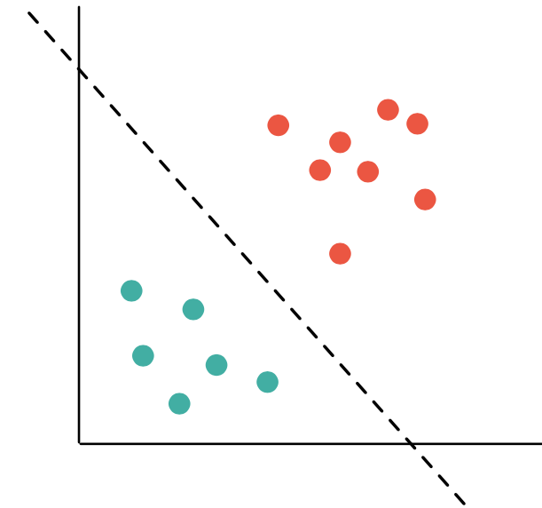

<!--
    Plan for the blog post: 
    
    - Intro to the subject (SVM, soft margin, hard margin)
    - How to use it
    - Example using csv file and Dataframe
    - Point on: 
      - Parallel branch about unfinished work
        - Unfinished work for Hard Margin QP
        - Unfinished work for Hard Margin SGD (link to the japanese github repo code example)
      - 
-->

Repository: https://github.com/pharo-ai/Support-Vector-Machines

## Support Vector Machines

Support Vector Machines (abbreviated as SVM) are supervised learning algorithms that can be used for classification and regression problems. They are based on the idea of finding a hyperplane that best separates the features into two classes. <!--SVMs are one of the most robust prediction methods.-->Suppose that we have a set of points in a two-dimensional feature space, with each of the points belonging to one of two classes. An SVM finds what is known as a separating hyperplane: a hyperplane (a line, in the two-dimensional case) which separates the two classes of points from one another.

Depending on the dataset and how we want to classify it there are three approaches of SVMs: **Hard Margin**, [**Soft Margin**](#soft-margin) and **Kernels**

## Soft Margin

## Example

## Note