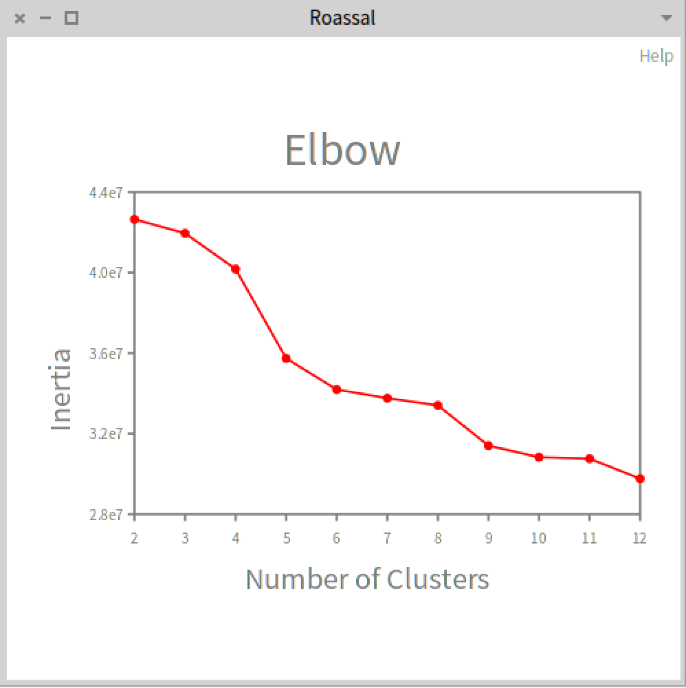
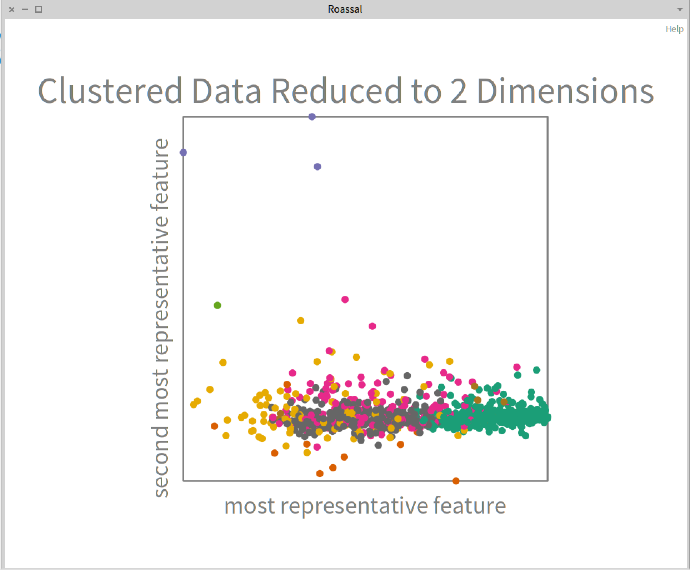

# Clustering Users of a Credit Card Company using the K-Means Algorithm

In this tutorial we will use the k-means clustering algorithm for classifying the clients based on their credit card consumption.

### Data Analysis and Manipulation

First, we will load the dataset.

```st
creditCardData := AIDatasets loadCreditCard.
```

If we inspect (open Pharo Inspector) the DataFrame, we can see that there is 18 features for each client of the credit card company.

```st
creditCardData columnNames. "('CUST_ID' 'BALANCE' 'BALANCE_FREQUENCY' 'PURCHASES' 'ONEOFF_PURCHASES'
'INSTALLMENTS_PURCHASES' 'CASH_ADVANCE' 'PURCHASES_FREQUENCY' 'ONEOFF_PURCHASES_FREQUENCY'
'PURCHASES_INSTALLMENTS_FREQUENCY' 'CASH_ADVANCE_FREQUENCY' 'CASH_ADVANCE_TRX' 'PURCHASES_TRX'
'CREDIT_LIMIT' 'PAYMENTS' 'MINIMUM_PAYMENTS' 'PRC_FULL_PAYMENT' 'TENURE')"
```

Also, after inspecting the data, we can see that it contains nil fields, so we will replace them with zeros

```st
creditCardData replaceAllNilsWithZeros.
```

Currently, the ID parameter is a string. It is the letter C along with a number. For example: `C10001`
So, we convert the ID field to be a numeric field

```st
creditCardData
    toColumn: 'CUST_ID'
    applyElementwise: [ :element | element asInteger ].
```

### K-Means Algorithm

For now, the K-Means algorithm expects an `Array` or a `Collection`. The data is an object of `DataFrame`. We need to convert the data from DataFrame to Array.

[Optional]
Also, for speeding up the computation, we will take 1000 random elements of the data. You can run it with the whole dataset but it will take some minutes to execute.

```st
dataAsArray := creditCardData asArrayOfRows shuffled first: 1000.
```

The data is too big and it has too many dimensions to be graph. So, to find the best number of clusters, we will train the model with 12 clusters.
Then, we will graph the error of the model with each number of clusters.

```st
numberOfClustersCollection := 2 to: 12.

"Create a collection for storing the errors."
inertias := OrderedCollection new.

"We train 11 k-means models, and store the error of each of them"
numberOfClustersCollection do: [ :numberOfClusters |
	kMeans := AIKMeans numberOfClusters: numberOfClusters.
	kMeans fit: dataAsArray.  
	inertias add: (kMeans score: dataAsArray) ].
```

By definition, if the number of clusters the error will always reduce. There is different technoques to find the best number of clusters. We will use the elbow method.

If we graph the errors, the curve will look like an arm. We need to manually the point in which the graph starts decreasing the looses.

We will use [Roassal 3](https://github.com/ObjectProfile/Roassal3) for doing the plot. We will not explain the code in this tutorial.

According to the elbow graph, we can see that the best number of cluster is nine clusters.



Code for plotting the elbow graph.

```st
"Elbow draw with Roassal"
elbowChart := RSChart new.
elbowChart extent: (numberOfClustersCollection size * 20) @ (7 * 20).
elbowChart addPlot:
	(RSLinePlot new
		x: numberOfClustersCollection y: inertias;
		color: Color red;
		fmt: 'o';
		yourself).
elbowChart addDecoration:
	(RSHorizontalTick new
		numberOfTicks: numberOfClustersCollection size;
		integer;
		yourself).
elbowChart addDecoration:
	(RSVerticalTick new
		asFloat;
		yourself).

elbowChart xlabel: 'Number of Clusters'.
elbowChart ylabel: 'Inertia'.
elbowChart title: 'Elbow '.
elbowChart build.
elbowChart canvas open.
```

If we look at the elbow graph, we it seems that the best number of clusters is 9. Note that you may have not the exact same results. 

We train the algorithm again with that number of clusters.

```
kMeans := AIKMeans numberOfClusters: 9.
kMeans fit: dataAsArray.  

clusters := kMeans clusters.
```

Summary of the code of the whole tutorial

```st
""
"DATA ANALYSIS AND MANIPULATION"
""

"Load credit card dataset"
creditCardData := AIDatasets loadCreditCard.

"If we inspect the DataFrame, we can see that there is 18 features for each client of the credit card company"

creditCardData columnNames. "('CUST_ID' 'BALANCE' 'BALANCE_FREQUENCY' 'PURCHASES' 'ONEOFF_PURCHASES' ...)"

"Also, after inspecting the data, we can see that it contains nil fields, 
so we will replace them with zeros"
creditCardData replaceAllNilsWithZeros.

"Currently, the ID parameter is a string.
It is the letter C along with a number. For example: C10001
So, we convert the ID field to be a numeric field"
creditCardData
    toColumn: 'CUST_ID'
    applyElementwise: [ :element | element asInteger ].

""
"K-MEANS ALGORITHM CLUSTERING"
""

"Convert the data from DataFrame to Array and take 1000 random elements to speed up."
dataAsArray := creditCardData asArrayOfRows shuffled first: 1000..

"We train the model with 12 clusters"
numberOfClustersCollection := 2 to: 12.

"Create a collection for storing the errors."
inertias := OrderedCollection new.

"We train 11 k-means models, and store the error of each of them"
numberOfClustersCollection do: [ :numberOfClusters |
	kMeans := AIKMeans numberOfClusters: numberOfClusters.
	kMeans fit: dataAsArray.  
	inertias add: (kMeans score: dataAsArray) ].

"If we look at the elbow graph, we see that 9 clusters seems to be the best solution."
kMeans := AIKMeans numberOfClusters: 9.
kMeans fit: dataAsArray.  

clusters := kMeans clusters.
```

## Principal Component Analysis

Principal component analysis (PCA), is a statistical method that allows to summarize the information of a dataset. It gives the k-most representative features of data. It can be used to more easily visualise the data.

For doing this, we will use [PolyMath](https://github.com/PolyMathOrg/PolyMath) library that is loaded in the pahro-ai library.

[Optional]
For speeding purposes, we will take 1000 random elements of the data. You can run it with the whole dataset but it will take some minutes to execute.

```st
"For doing the principal component analysis (PCA), we will take randomly 1000 elements for speed up the computation"
shuffledData := creditCardData asArrayOfRows shuffled first: 1000.
```

Now, we create our PolyMath matrix

```st
polyMathMatrix := PMMatrix rows: shuffledData.
```

Wa want to plot the data. So, we want 2 parameters, one for the x axis and the other one for the y axis.

We train the principal component analyser for 2 components.

```st
pca := PMPrincipalComponentAnalyserSVD new.
pca componentsNumber: 2.
pca fit: polyMathMatrix.
principalComponents := pca transform: polyMathMatrix.
```

As we discussed in the last part, we see that 9 is the number of clusters that work the best. We train again our model.

```st
kMeans := AIKMeans numberOfClusters: 9.
kMeans fit: shuffledData.  

clusters := kMeans clusters.
```

Now, we gain the two principal components of the data to reduce the data dimension to 2.

```st
xPrincipalComponent := principalComponents rows collect: [ :each | each first].
yPrincipalComponent := principalComponents rows collect: [ :each | each second].
```

We use those `x` and `y` to graph the data with its different groups.

```st
colors := RSColorPalette qualitative dark28 range.

clusteredDataChart :=RSChart new.
clusteredDataChart addPlot: (plot := RSScatterPlot new x: x y: y ).
clusteredDataChart 
    xlabel: 'most representative feature';
    ylabel: 'second most representative feature';
    title: 'Clustered data reduced to 2 dimensions'.

clusteredDataChart build.

plot ellipses doWithIndex: [ :e :i| 
    e color: (colors at: (clusters at: i)) ].

clusteredDataChart canvas open.
```

We see that the graph is very confusing. We have to keep in mind that the data has 11 dimensions, we we graph it only using 2. So, we lost information. We need to find better ways of visualising the data. Also, we choose the principal components using information of around only 1/9 of the whole dataset. Finallly, it can be that the k-means algorithm may not be the best approach for this problem. This is only a teaching example.



Summary of the dimensionality reduction code

```st
"take randomly 1000 elements for speed up the computation"
shuffledData := creditCardData asArrayOfRows shuffled first: 1000.

polyMathMatrix := PMMatrix rows: shuffledData.

pca := PMPrincipalComponentAnalyserSVD new.
pca componentsNumber: 2.
pca fit: polyMathMatrix.
principalComponents := pca transform: polyMathMatrix.


"If we look at the elbow graph, we see that 9 clusters seems to be the best solution."
kMeans := AIKMeans numberOfClusters: 9.
kMeans fit: shuffledData.  

clusters := kMeans clusters.

"Get the principal components"
xPrincipalComponent := principalComponents rows collect: [ :each | each first].
yPrincipalComponent := principalComponents rows collect: [ :each | each second].

"Graph to show the different groups that were found using the clustering algorithm"

colors := RSColorPalette qualitative dark28 range.

clusteredDataChart :=RSChart new.
clusteredDataChart addPlot: (plot := RSScatterPlot new x: x y: y ).
clusteredDataChart 
    xlabel: 'most representative feature';
    ylabel: 'second most representative feature';
    title: 'Clustered data reduced to 2 dimensions'.

clusteredDataChart build.

plot ellipses doWithIndex: [ :e :i| 
    e color: (colors at: (clusters at: i)) ].

clusteredDataChart canvas open.
```