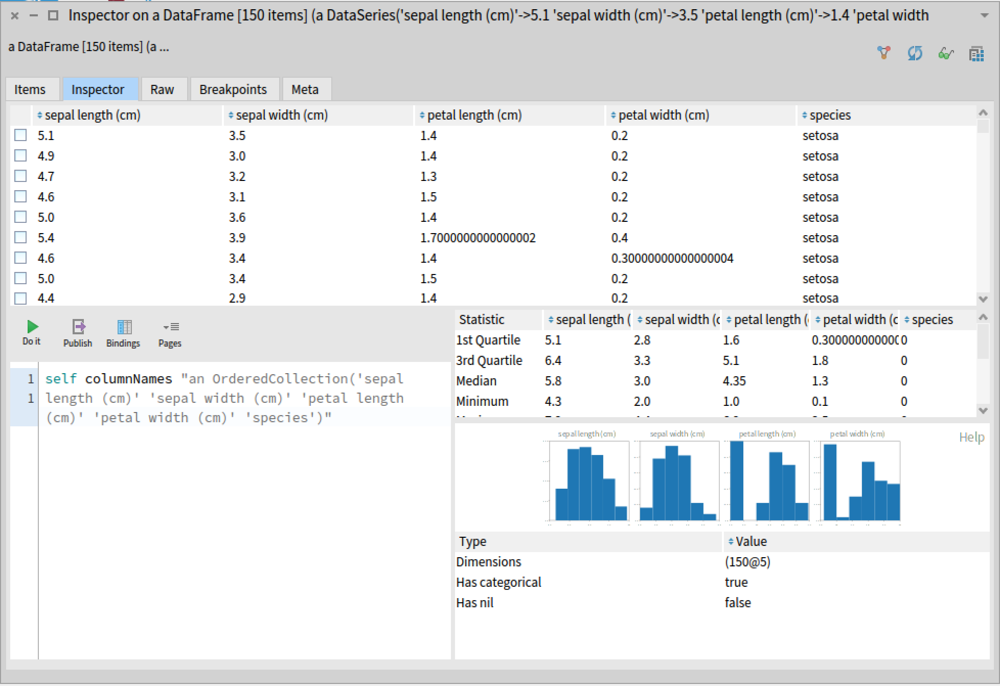
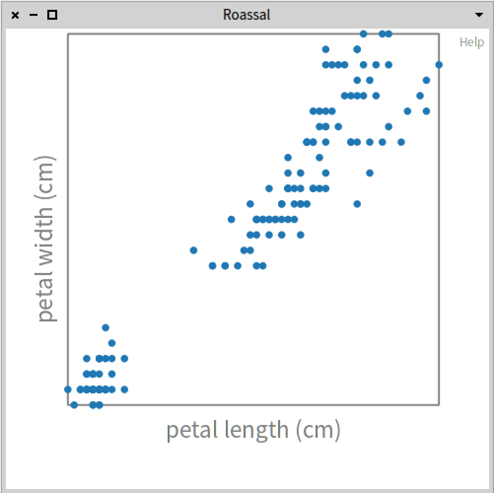
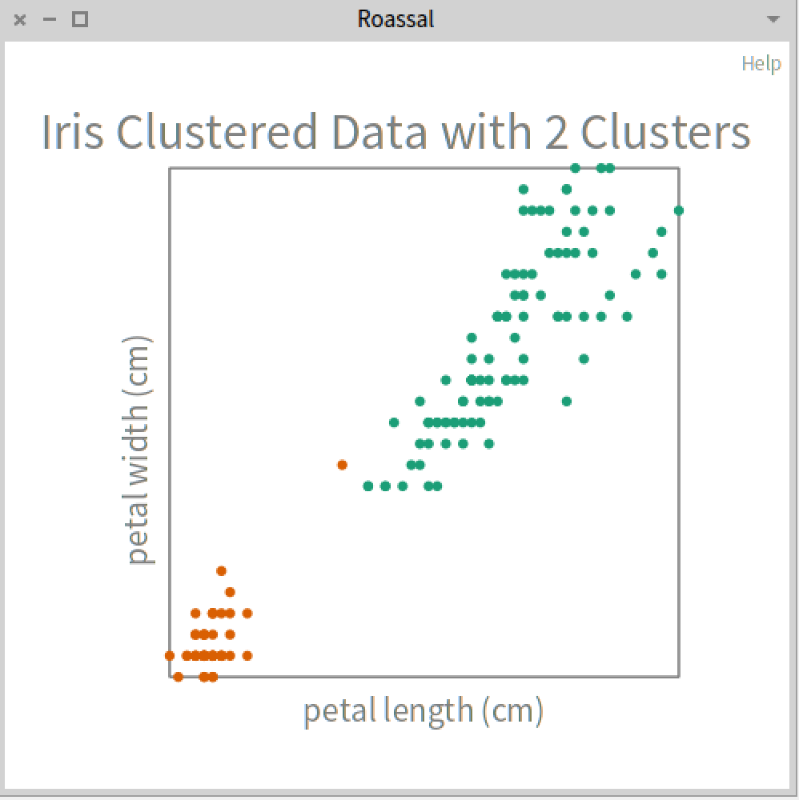
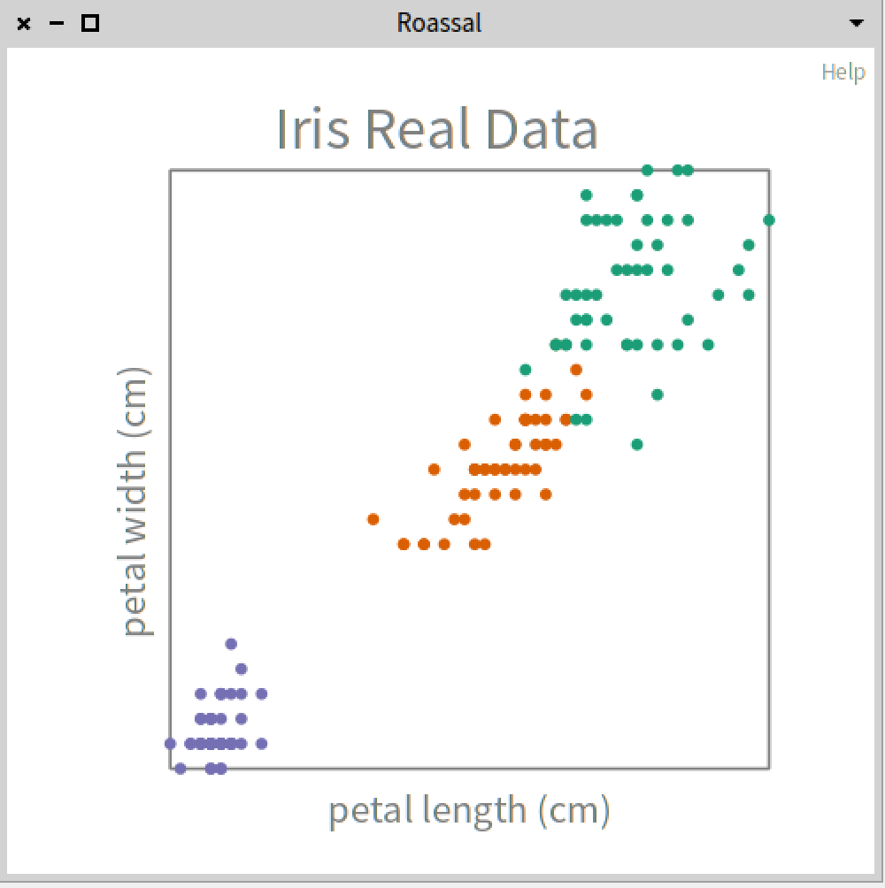

# Using K-Means Clustering Machine Learning Algorithm - Simple Example

_If you don't have the library installed, you can refer to: [Getting Started page](../GettingStarted/GettingStarted.md)_

In this example, we are going to cluster data using the k-means algorithm, using the iris dataset (yes, we know... but this dataset is well-suited for this example.)

As a first step, we will load the iris dataset:

```st
iris := AIDatasets loadIris.
```

If we inspect the variable (open the Pharo Inspector) you will see that you have 4 column names.



For plotting the data, we will use Roassal. In this tutorial we will not show the code, for simplicity purpous. You can see [their webpage](https://github.com/ObjectProfile/Roassal3).

For this example, we will use only two features of the flower: `petal length (cm)` and `petal width (cm)`. 



With the data plotted in this way, we can see, it seems the data can be clustered in two or three groups. So, we will keep only those.

```st
data := iris columns: #('petal length (cm)' 'petal width (cm)').
```

For the moment, the algorithm expects to receive a Collection. The variables `iris` and `data` are [DataFrame](https://github.com/PolyMathOrg/DataFrame) objects. So, we need to convert them to an Array.

```st
dataAsArray := data asArrayOfRows.
```

Now, we will create the K-Means clustering model with two clusters. That means, that the algorithm will automatically cluster the data into 2 groups.

```st
kMeans := AIKMeans numberOfClusters: 2.
kMeans fit: dataAsArray.
```

Finally, to see how to algorithm is clustering the data, we can inspect the clusters.

```st
clusters := kMeans clusters.
```

For better understanding the data, we can plot each data point with its corresponding group.



There is one point that it looks likat it is misplaced. We can try cluster the data into three groups.

```st
kMeans := AIKMeans numberOfClusters: 3.
kMeans fit: dataAsArray.
```

Now, if we plot again the data with each point belonging to its corresponding cluster, it will look like this:

We already know, by looking the dataset, that there is only three different groups of iris flowers. But, the k-means algorithm classified the data automatically.

This is the result of the cluster.


If we look at the real data plotted, we can see that there is five points that were assigned to the wrong cluster.



## All the code:

```st
"Load the dataset"
iris := AIDatasets loadIris.

"Inspect the data set (open the Pharo Inspector)"
iris columnNames. "('sepal length (cm)' 'sepal width (cm)' 'petal length (cm)' 'petal width (cm)' 'species')"

"Use only two features of the data"
data := iris columns: #('petal length (cm)' 'petal width (cm)').

"Convert the data from DataFrame to Array"
dataAsArray := data asArrayOfRows.

"Train the clustering algorithm"
kMeans := AIKMeans numberOfClusters: 3.
kMeans fit: dataAsArray.

"Gettting the clusters"
clusters := kMeans clusters.
```