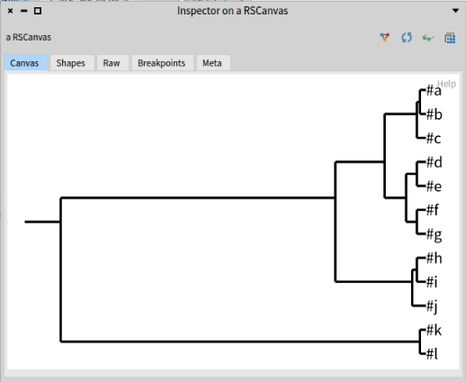

# Using Agglomerative Hierarchical Clustering Algorithm - Simple Example

## Overview

_If you don't have the library installed, you can refer to: [Getting Started page](../GettingStarted/GettingStarted.md)_

In this example, we are going to cluster data using the hierarchical clustering algorithm on a dummy example.

Hierarchical  clustering works on a collection of vectors representing *elements* to cluster.
Each element is represented by an `AIVectorItem`.

The agglomerative hierarchical clustering algorithm will recursively group together the two closest elements of the collection into one new cluster.

1. Each elements can be seen as an atomic cluster;
1. Group two closest clusters (atomic or not) into one;
1. Thus at each iteration, there is one less cluster in the collection (replacing two clusters by their new parent);
1. Recompute the distance from new cluster to all remaining ones
1. Go back to step 2. until there is only one cluster left (the "root") containing all the initial elements.

## Example

We will use a dummy example of 12 elements.

We make an **Array** of `AIVectorItem`:
```st
elts := {
	AIVectorItem with: #a and: #(1 0).
	AIVectorItem with: #b and: #(1 0).
	AIVectorItem with: #c and: #(2 0).
	AIVectorItem with: #d and: #(3 0).
	AIVectorItem with: #e and: #(4 0).
	AIVectorItem with: #f and: #(5 0).
	AIVectorItem with: #g and: #(6 0).
	AIVectorItem with: #h and: #(7 0).
	AIVectorItem with: #i and: #(8 0).
	AIVectorItem with: #j and: #(9 0).
	AIVectorItem with: #k and: #(0 10).
	AIVectorItem with: #l and: #(0 10).
}.
```

Note that #a is equal to #b and #k is equal to #l. therefore they will be the first elements to be grouped in clusters in iteration 1 and 2 of the algorithm.

To compute the hierarchy of clusters (called a *Dendrogram*) we use:
```st
engine := AIClusterEngine with: elts.
engine hierarchicalClusteringUsing: #averageLinkage.
```

The dendrogram can be found in `engine dendrogram` it's a binary three with a `#left` and `#right` children.

Note: The dendrogram may be visualized with Roassal extension: [https://github.com/pharo-ai/viz](https://github.com/pharo-ai/viz).
For this, just execute `engine plotDendrogram`



## Configuration

The argument `#averageLinkage` in the code above is used to compute the distance of new clusters to the other ones.
There are 3 values possible:
- `#singleLinkage`: Distance between two clusters is the distance between their two closest (more similar) objects.
- `#averageLinkage`: Distance between two clusters is the arithmetic mean of all the distances between the objects of one and the objects of the other.
- `#completeLinkage`: Distance between two clusters is the distance between their two most dissimilar objects.

Single Linkage can result in clusters formed of a "chain of elements" but the first and last elements quite far from one another.


Complete linkage results in clusters with "compact contours", but elements not necessarily compact inside.
Notice that the left branch of the big cluster (ie. top branch on the plot) is better balanced with Complete linkage than with Average linkage (first figure above)


## Distance matrix

In the code above, the distance matrix is a default one computed from the elements.
In this case the distance is the sum of the square differences between two vectors.

One can provide a different matrix using any other possible metrics.
This must be a **distance** matrix (higher value means more different), not a similarity matrix (higher value mean more similar).

## Threshold

In the plots, the horizontal bar are not always at the same position.
This depends on the `threshold` of each cluster.
The threshold of a cluster can be seen as the distance between its two elements.

With less elements, the threshold is typically small (elements close one to the other).
With more elements, the difference start to be bigger and the threshold augment.

If you compare the first plot (average linkage) and the last one (complete linkage), you might see that the threshold of the first left node is smaller with average linkage.
The two clusters contain the same elements (10 elements with a 0 as second part).
But because complete linkage computes the distance between two clusters as the distance between their two most dissimilar objects, the threshold ends up being higher.