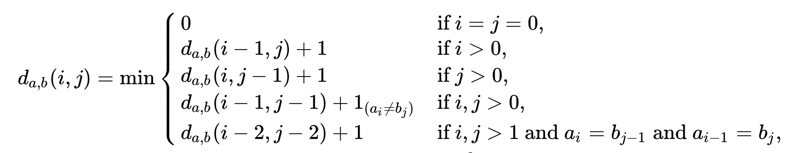
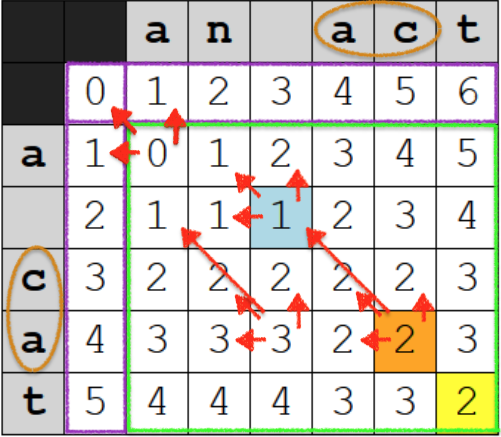

# Understanding Edit Distances

Repository: https://github.com/pharo-ai/edit-distances 

In this tutorial we're going to see what edit distance is about and some cool applications in everyday life that are implemented with this distance metrics. First of all, let's explain what is an edit distance.
Given two strings (finite sequence of symbols) $s_1$ and $s_2$, the edit distance between them is the minimum number of edit operations required to transform $s_1$ into $s_2$. So we can say that with this distance we able to measure the similarity of corresponding symbols. The basic edit operations here are: 

• Substitutions  
• Deletions  
• Insertions 

We say basic for operations because when changing one string into another we usually have to subsitute, delete or insert a character or a symbole (depends on what you're working with). Say you want to write `fork` but instead you wrote `zork`, to correct this sadly mistake you subtitute the `z` for `f`. If we give to this operation the value of 1 (common given value), then `zork` is _1 edit distance away from `fork`_. There are evidently other operations that one can do such as transpositon. And so the variants of edit distance that exist are obtained by restricting the set of operations or adding more.

Also, Edit Distance has properties of dynamic programming because the basic principle of dynamic programming is to decompose a problem into stages and find optimal solutions for each stage and save each solution. And that is exactly how different edit distance algorithms work. 

 #  How does edit distance algorithm works ? 

 The idea is to build a distance matrix. Here we're going to show the progress of the retricted Damerau-Levenshtein and the full Damerau-Levenshtein algorithm. By explaining these two algorithms you will understand the Levenshtein algorithm as well since they are based on this last.

## Restricted Damerau-Levenshtein distance :  

For 2 words, such as `'a cat'` and `'an act'`, a matrix of size 5x6 is created as shown in the matrix bellow. Note that the row and column surrounded in light purple are not part of the matrix they are just added to start to count correctly. 

For calculating the cost of each cell we procede by using this function :

<br>


This function bellow defines the restricted Damerau-Levenshtein distance. The four first conditions only, define the Levenshtein distance.

- Okay so for each cell, as said we apply the function bellow. Let's take the cell (5,4) for example. Note that in Pharo we start at 1 and not 0. The indexes i are for the rows and j are for the columns.  
- So we calculate the min of the upper cell value +1, the left cell value +1 and the upper-left cell +( 0 if the characters of this cell are equal and 1 if they're not - in this case no, they're not). These cells are the one indicated with the red arrows, min(2+1,3+1,2+1) = 3. Now, if we stop here we would have calculated the edit distance using Levenshtein distance. 
- To use the restricted Damerau-Levenshtein we have to calculate the transposition operation too (swap two consecutive characters). This is possible with the last condition of our function above. Which is the value of the cell (i-2,j-2). Here its value is 1, so we do the same as we did before, we calculate the min ((2+1,3+1,2+1,1+1) = 2. It's the cell coloured in green. This cell gives us the vaue of restricted Damereau-Levenshtein distance between our first string "a cat" and our second string "an act".
- _Note_ : Edit distance has properties of dynamic programming. Because at each stage of the algorithm we have the optimal choice. Back to our example of the cell (5,4), if you see this cell represents the substrings `"a ca"` and `"an "`. The edit distance between these two is 3 - since we have to add "n" after the "a" and add "c" and "a" after the space character " ". Three edit operations to transform "a ca" into "an ".
- _Continuity of note_: If you take any cell of the matrix you'll notice that the value of it is the edit distance of the substrings that is related to. So obviously, the last cell in green is the value of the edit distance of our two starting strings.

<br>


## Damerau-Levenshtein distance :

For 2 words, such as 'a cat' and 'an abct', a matrix of size 5x6 is created as shown in the matrix bellow. Note that the rows and columns surrounded in dark and light purple are not part of the matrix they are just added to count correctly s.

The main difference between the retricted algorithm and this one is that in the first we couldn't calculate a transposion of non-adjacents characters. In other words, we couldn't edit a substring that was already edited. In the example of the matrix bellow we have the first string `"a cat"` and second string `"a abct"`. "ca" could be swapped (swap = tanspose) with "ac". But we couldn't re-edit this substring to add "b" to it and have "abc". On the contrary, in the non-restricted Damerau-Levenshtein distance we can ! Let's see how.
- Let's take the example of cell (6,7). We apply the levenshtein function (the first four conditions of the equation above) to calculate the edit distance value of the cell. In addition to that, we calculate the value of transposition. To know if we have a transposion or not we:  
  - First, go through the rows in backwards from our current cell (Matrix: red arrow from blue cell to cell with star ) and stop when we find row with the current column's character -  here we're looking for the character `"c"`.   
  - Second, go through the columns in backwards from the cell we stopped in (here the blue one) and look for the column in this row where the characters match with the characters of our curent cell (Remember our current cell is still (6,7)). One row back (j-1) we have (c,b) not a match, two rows back (j-2) we have (a,c) it's a match ! 
  - Now we're in cell (5,5). Go to the upper-left cell of it, (4,4). Notice that the value of this cell it's the edit distance before transposition. Here to calculate the transposition, we take the value of the cell we're in (the cell before transposition) so we have 0. We add to it the cost 1 of the transposition since it's an edit operation itself, so now we have 0 + 1 = 1. We add the number of columns and rows we have in between our charcters that can be swapped because we have to calculate how many edit operations we have to do along with the transposition.
    - Columns: we have 1 column between our two characters that can be swapped, column for character "b".
    - Rows: we have 0 rows between our two characters that can be swapped.
  - Let's count then: 0 + 1 + 1 + 0 = 2. This is the value of the cell in blue.
  - Do the same thing for each cell. At the end we have an edit distance of 2 (cell in green).

- And that's how Damerau-Levenshtein algorithm works. In the code in Pharo, instead of going backwards through the rows, we hold a dictionary with each character of the first string and it's number of row. Then we only have to compare our current column's character with the matching character from the dictionary and get the number of the row.

<br>


## Comparing both distances in Pharo  

```st
levenshetein := AILevenshteinDistance new.
restrictedDL := AIRestrictedDamerauLevenshteinDistance new.
fullDL := AIDamerauLevenshteinDistance new.
```

```st
levenshetein distanceBetween: 'a cat' and: 'an act'. "3"
```

```st
restrictedDL distanceBetween: 'a cat' and: 'an act'. "2"
```

```st
fullDL distanceBetween: 'a cat' and: 'a abct'. "2"
```

```st
restrictedDL distanceBetween: 'a cat' and: 'a abct' "3"
```  


#  What they are used for ?

The usefulness of edit distances differs from one use to another. By default, a lower distance implies greater similarity between two words. However, in NLP(Natural Language Processing) we generally wish to minimize the distance, not being the case in computational biology where we wish to maximize similarity. Or even in error correcting codes, where we wish to maximize the distance so that one codeword is not easily confused with another. There are many application domains where you might find the utilisation of edit distance such as:

- **Spelling correction** :  For example a user typed `graffe`, which word is the closest ?
  - graf
  - graft
  - grail
  - giraffe
   
Using the edit distance metric we can affirm that `giraffe` is the closest. That's how correcting spelling works. It compares every word typed with thousands of correctly spelled words and then uses the edit distance metric to determine the correct spellings by choosing the lowest distance between the typed word and the words of our dictionary.
  
- **DNA sequence alignment** - [Example](#dna-sequence-alignments) : We might want to know the purpose of sequence alignment, well it's important when identifying regions of similarity that may be a consequence of functional, structural, or evolutionary relationships between the sequences

  
# Some applications in Machine Learning

Just to put in context we're going to quickly prompt the definiton of Machine Learning:  
_It's the use and development of computer systems that are **able to learn and adapt without following explicit instructions**, by using algorithms and statistical models to analyse and draw inferences from patterns in data._
So it's kind of about prediction, we don't have to repeat a task that could be done mechanicaly (automatically) after training our algorithm or machine on a historical dataset and applying to new data. Here are some machine learning domains that use edit distance:

- **Recommendation systems** (use of algorithm that suggests relevant items to users): Using the Cosine Similarity distance, its value which is located in the interval of 0 and 1 represent the percentage of similarity between the items (73%, 50%, ... of similarity).
- **Optical character recognition** : Recognize the off-line characters from text images. Allows you to quickly and automatically digitize a document without the need for manual data entry.
- **Document similarity** : Used in Information Retrieval which goal is to develop a model for retrieving(collecting) information from the repositories of documents.
- **Image Data Matching For Entity Resolution** : Used to track google images results for product design copyright infringement or product matching across different competitors to understand market size or price tracking.
<!--- **Plagiarism detection**  add doc -->
# Example

## DNA sequence alignment  

**Computational biology** is a field in which computers are used to do research on biological systems. Here we will compute DNA sequence alignments. The optimization process involves evaluating how well individual base pairs match up in the DNA sequence case. 

**Biology review**: DNA is an acid that contains all of the hereditary genetic information that comes as an "instruction manual". It is composed of four biological macromolecules {Adenine (A), Thymine (T), Guanine (G), Cytosine (C)} that together forme a string called _genetic sequence_.

**In bioinformatics**, a sequence alignment is a way of arranging the sequences of DNA, RNA, or protein to identify regions of similarity that may be a consequence of functional, structural, or evolutionary relationships between the sequences.

**Relation with edit distance?** : 

 The edit-distance is the score of the best possible alignment between two genetic sequences over all possible alignments.

**Why sequence alignment?**  

•  Assembling fragments to sequence DNA.  
•  Compare individuals to looking for mutations.

For our example we want to compare a DNA sequence of a gene that we found in an  unstudied organism. For what? To know the function of the protein that this gene encodes by comparing it to other sequences and chose the the one with the lowest distance - since it means that is the most similar and has similar functions. So using edit distance, we will measure the similarity of this gene with two other genes that have been sequenced before and whose functions are understood.

So let's compare this sequence:

`G C T A A C T C G G A`

with this one

`C G T A A C A C G G A`

and this one

`C G T A A C A C T T G`

We're going to use the Levenshtein distance.

```st
|firstSequence secondSequence|

levenshetein := AILevenshteinDistance new.

unknownSequence := 'GCTAACTCGGA'.

firstSequence := 'CGTAACACGGA'.

secondSequence := 'CGTAACACTTG'.

levenshetein distanceBetween: unknownSequence and: firstSequence.  "3"

levenshetein distanceBetween: unknownSequence and: secondSequence.  "6"

```

The more similar sequence between these two is the first one, so for the researches biologists will chose the first over the second one to find the functions of the protein this unknown gene sequence encodes.


<!-- Temporary notes:
    - But our focus
    - The logic behind ...
  Given two biological sequences (strings of DNA nucleotides or protein amino acids) of length n , the basic problem of biological sequence comparison can be recast as that of determining the Levenshtein distance between them. Biologists prefer to use a generalized Levenshtein distance where instead of simply counting the number of substitutions, insertions, and deletions, each operation will have a different cost depending on where in the string it is applied; i.e. common substitutions will have a lower cost than uncommon ones.


[_General definiton_ ](https://github.com/pharo-ai/wiki/blob/master/wiki/StringMatching/Edit-distances.md) 


 -->