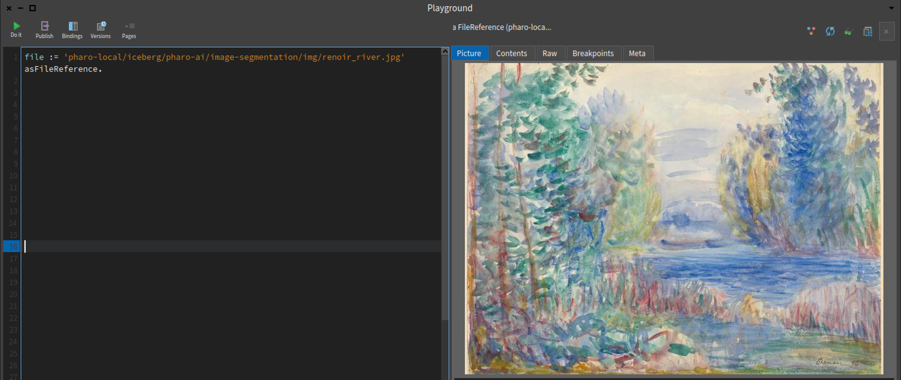
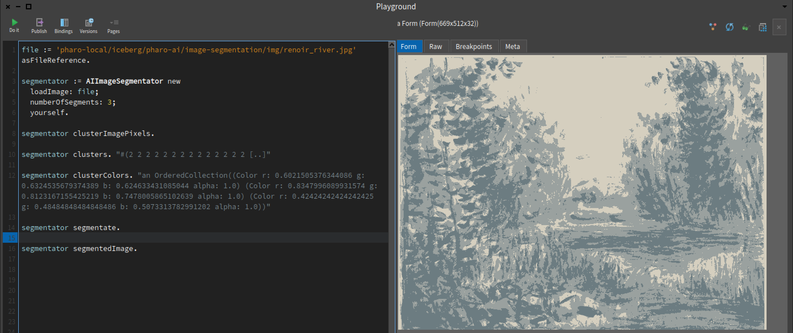
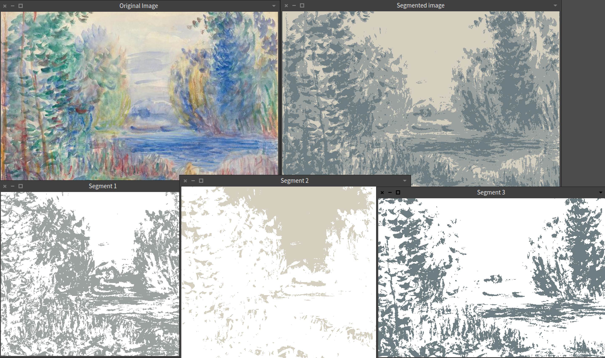

# Image segmentation using K-Means

Image segmentation is the process of assigning a label to every pixel of an image. The pixels are grouped into clusters that share certain characteristics.

By doing this, it reduces the complexity of the image. This can help for finding, for example, the silhouette of a figure.

In this tutorial, we will use the [K-Means](https://github.com/pharo-ai/k-means) algorithm for segmenting the image.

## Installing the project

First, you need to install our image segmentation project, available in https://github.com/pharo-ai/image-segmentation.

You can execute the following Metacello script in the Pharo Playground.

```st
Metacello new
  baseline: 'AIImageSegmentation';
  repository: 'github://pharo-ai/image-segmentation';
  load.
```

## Importing the image

For the sake of this tutorial, we will use some open source images that are installing along with the project. But, you can use whatever image that you want. Just keep in mind that the bigger the image is, the longer the algorithm is going to take to fit.

We will use the picture of a painting of [Renoir](https://en.wikipedia.org/wiki/Pierre-Auguste_Renoir).

First, we will import the image as a file reference.

```st
file := 'pharo-local/iceberg/pharo-ai/image-segmentation/img/renoir_river.jpg' asFileReference.
```

We have the image as a `FileReference` object.



## Using the image segmentator

Let's create the image segmentation model. After creating the object, we need to load the image using the `loadImage:` message. That method, will convert the `FileReference` object into an instance of `Form`. Also, we need to specify the number of segments. That means in how many colors the image will be segmented. In this case we will chose 3 segments (or colors).

```st
segmentator := AIImageSegmentator new
  loadImage: file;
  numberOfSegments: 3;
  yourself.
```

To cluster the pixel of the image, we need to send the message `clusterImagePixels` to the `segmentator`. This will fit the k-means algorithm with the image that we passed. Note that is the image is too big, this can take some time. With the Renoir image that we are using, this takes only some seconds.

```st
segmentator clusterImagePixels.
```

We have clustered the pixels of our image.

We can inspect the clusters with:

```st
segmentator clusters. "#(2 2 2 2 2 2 2 2 2 2 2 2 2 2 [..]"
```

We can also see the colors that were assigned to each of the clusters:

```st
segmentator clusterColors. "an OrderedCollection((Color r: 0.6021505376344086 g: 0.6324535679374389 b: 0.624633431085044 alpha: 1.0) (Color r: 0.8347996089931574 g: 0.8123167155425219 b: 0.7478005865102639 alpha: 1.0) (Color r: 0.42424242424242425 g: 0.48484848484848486 b: 0.5073313782991202 alpha: 1.0))"
```

Now, after clustering the pixels of the image, we want to segmentate it. To do that, we send the message `segmentate` to the `segmentator`.

```st
segmentator segmentate.
```

The image is segmented. We can inspecting using the message.

```st
segmentator segmentedImage.
```



We see the same Renoir painting but only with 3 colors. Cool!

We can also inspect each of the image segments with.

```st
segmentator segments.
```

Or, we can open all the images (original image, the segmented one and each of the segments) with 

```st
segmentator openAll.
```



## Summary of the code

```st
file := 'pharo-local/iceberg/pharo-ai/image-segmentation/img/renoir_river.jpg' asFileReference.

segmentator := AIImageSegmentator new
  loadImage: file;
  numberOfSegments: 3;
  yourself.

segmentator clusterImagePixels.

segmentator clusters. "#(2 2 2 2 2 2 2 2 2 2 2 2 2 2 [..]"
segmentator clusterColors. "an OrderedCollection((Color r: 0.6021505376344086 g: 0.6324535679374389 b: 0.624633431085044 alpha: 1.0) (Color r: 0.8347996089931574 g: 0.8123167155425219 b: 0.7478005865102639 alpha: 1.0) (Color r: 0.42424242424242425 g: 0.48484848484848486 b: 0.5073313782991202 alpha: 1.0))"

segmentator segmentate.

segmentator segmentedImage.
segmentator segments.
segmentator openAll
```
