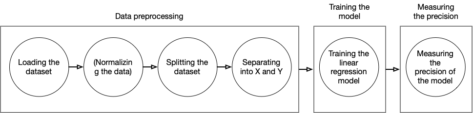
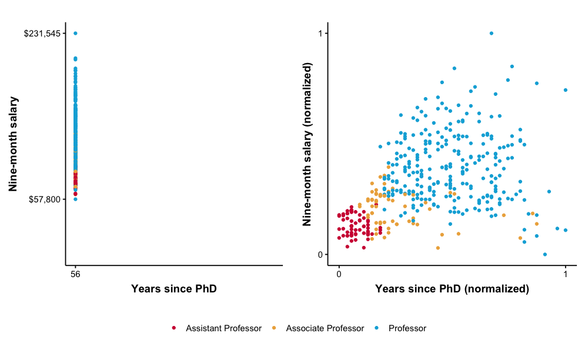

# Hands-On Linear Regression

Linear regression is a machine learning model that learns the linear dependencies between the independent variables and the dependent variable. It is capable of making predictions for previously unseen values once it has learned.

Here we will use the renowned [Boston Housing dataset](https://www.cs.toronto.edu/~delve/data/boston/bostonDetail.html) to train the linear regression model. The Boston dataset that contains 13 parameters of a house, like its surface,per capita crime rate by town, etc and as an output the median value of owner-occupied homes in $1000's.

First, we will load the dataset. Then, normalizing the data, to split between test and training datasets. After, training the logistic regression model and finally measuring its performance.



If you have not done this yet, you can install the [pharo-ai](https://github.com/pharo-ai/ai) library by executing the following sctipt in your Pharo Playground:

```st
EpMonitor disableDuring: [
    Metacello new
        baseline: 'AIPharo';
        repository: 'github://pharo-ai/ai/src';
	onWarningLog;
        load ]
```

## Table of Contents  

- [Preprocessing the data](#preprocessing-the-data)
- [Training the machine learning model](#training-the-machine-learning-model)
- [About normalization](#about-normalization)
- [Measuring the performance of the model](#measuring-the-performance-of-the-model)
- [Workflow summary](#workflow-summary)

## Preprocessing the data

We will use [Pharo Datasets](https://github.com/pharo-ai/Datasets) to load the dataset into the Pharo image. The library contains several datasets ready to be loaded. Pharo Datasets will return a [Pharo DataFrame](https://github.com/PolyMathOrg/DataFrame) object. To install Pharo Datasets you only need to run the code sniped of the Metacello script available on the [README](https://github.com/pharo-ai/Datasets)

First, we load the boston housing dataset into the Pharo image.

```st
"Loading the dataset"
bostonHousingDataset := AIDatasets loadBostonHousing.
```

Now, to train the machine model we need to separate the dataset into at least two parts: one for training and the other for testing it. We have already a library in Pharo that does that: [Random partitioner](https://github.com/pharo-ai/random-partitioner). It is already included be default if you load the Pharo Datasets library.

We will separate it into two sets: test and train. We need this to train the model and after to see how precisely the model is predicting.

```st
"Dividing into test and training"
partitioner := AIRandomPartitioner new.
subsets := partitioner split: bostonHousingDataset withProportions: #(0.75 0.25).
bostonHousingTrainDF := subsets first.
bostonHousingTestDF := subsets second.
```

Then, we need to obtain the X (independent, input variables) and Y (dependent, output variable) for each one of the test and training sets.

```st
"Separating between X and Y"
bostonHousingTrainDF columnNames. "an OrderedCollection('CRIM' 'ZN' 'INDUS' 'CHAS' 'NOX' 'RM' 'AGE' 'DIS' 'RAD' 'TAX' 'PTRATIO' 'B' 'LSTAT' 'MEDV')"

xTrain := bostonHousingTrainDF columns: #('CRIM' 'ZN' 'INDUS' 'CHAS' 'NOX' 'RM' 'AGE' 'DIS' 'RAD' 'TAX' 'PTRATIO' 'B' 'LSTAT').
yTrain := bostonHousingTrainDF column: 'MEDV'.

xTest := bostonHousingTestDF columns: #('CRIM' 'ZN' 'INDUS' 'CHAS' 'NOX' 'RM' 'AGE' 'DIS' 'RAD' 'TAX' 'PTRATIO' 'B' LSTAT ).
yTest := bostonHousingTestDF column: 'MEDV'.
```

Finally, as our linear regression model only accepts `SequenceableCollection` and not `DataFrame` objects (for now!), we need to convert the DataFrame into an array. We can do that only sending the message `asArray` or `asArrayOfRows`.

```st
"Converting the DataFrame into an array of arrays For using it in the linear model.
For now, the linear model does not work on a DataFrame."
xTrain := xTrain asArrayOfRows.
yTrain := yTrain asArray.

xTest := xTest asArrayOfRows.
yTest := yTest asArray.
```

## Training the machine learning model

We have everything that is needed to start training the linear regression model. We need to load the [Linear models library](https://github.com/pharo-ai/linear-models) from pharo-ai. That library contains both the logistic regression and linear regression algorithms. Both algorithms have the same API.

We instantiate the model, set the learning rate and the max iterations (if not set, the model will use the default values). After that, we train the model with the `trainX` and `trainY` collections that we have obtained.

```st
"Training the linear regression model"
linearRegression := AILinearRegression
	learningRate: 0.1
	maxIterations: 5000.
    
linearRegression fitX: xTrain y: yTrain.
```

If you try to run all the code that we wrote until now, you most likely saw an exception with the message: `The model is starting to diverge. Try setting up a smaller learning rate or normalizing your data.` It is normal! Usually, a model starts to diverge when the data is not normalized or the learning rate is too high. In this case is because the data is not normalized.

## About normalization

### What is normalization?

In statistics and machine learning, normalization is the process which transforms multiple columns of a dataset to make them numerically consistent with each other (e.g. be on the same scale) but in the same time preserve the valuable information stored in these columns.

For example, we have a table that the Salaries that a person earns according to some criteria. The values of variable Years since PhD are in the range of `[1 .. 56]` and the salaries `[57,800 .. 231,545]`. If we plot the two variables we see:



So, the big difference between the range of the values can affect out model.

If you want to read more about normalization Oleks has a [nice blog post](https://blog.oleks.fr/normalization) about it.
>Part of the text for explaining normalization were extracted from that post.

For normalizing our data, DataFrame has a simple API: we just call the `DataFrame >> normalized` method that returns a new DataFrame that has been normalized. This method uses the default normalizer that is the min max normalizer. If you want to use another one you can use the method `DataFrame >> normalized: aNormalizerClass` instead.

So, we just execute this part **before** partitioning the data.

```st
"Normalizing the data frames"
normalizedDF := bostonHousingDataset normalized.
```

Pay attention, now, as we want to use the normalized data, in the partitioning part we need to use the `normalizedDF` variable instead of the `bostonHousingDataset`.

```st
subsets := partitioner split: normalizedDF withProportions: #(0.75 0.25).
```

## Measuring the performance of the model

Now we can make predictions for previously unseen values: estimate the price of a new house based in its parameters. To make a prediction we need to send the message `predict:` to the linear regression model with the data that we want to predict as an argument.

```st
yPredicted := linearRegression predict: xTest.
```

We want to see how well our model is performing. In Pharo we also have a library for measuring the metrics of machine learning models: [Machine learning metrics!](https://github.com/pharo-ai/metrics). As usual, you will find the Metacello script for installing it on the README file.

For a linear regression model we have several metrics implemented:
- Mean Squared Error (AIMeanSquaredError)
- Mean Absolute Error (AIMeanAbsoluteError)
- Mean Squared Logarithmic Error (AIMeanSquaredLogarithmicError)
- R2 Score (AIR2Score)
- Root Mean Squared Error (AIRootMeanSquaredError)
- Max Error (AIMaxError)
- and Explained Variance Score (AIExplainedVarianceScore)

For this exercise will we use the R2 score metric (coefficient of determination). It is a coefficient that determinates the proportion of the variation in the dependent variable that is predictable from the independent variables. That means: How close are the predictions to the real values.

If the value of r2 is 1 means that the model predicts perfectly.

```st
"Computing the accuracy of the logistic regression model"
metric := AIR2Score new.

r2Score "0.7382841848355153" := (metric computeForActual: yTest predicted: yPredicted) asFloat.
```

We have obtained a 74% as a coefficient of determination.

## All the code

Here is the complete workflow of the exercise in which we have worked today. You can run everything in a Pharo Playground to play with the model.

Do not forget that you need to install the libraries to this to work.

```st
"Loading the dataset"
bostonDataset := AIDatasets loadBostonHousing.


"Normalizing the data frames"
normalizedDF := bostonDataset normalized.


"SEPARATING THE DATA"
"Dividing into test and training"
partitioner := AIRandomPartitioner new.
subsets := partitioner split: normalizedDF withProportions: #(0.75 0.25).
bostonHousingTrainDF := subsets first.
bostonTestDF := subsets second.


"Separating between X and Y"
bostonHousingTrainDF columnNames. "an OrderedCollection('CRIM' 'ZN' 'INDUS' 'CHAS' 'NOX' 'RM' 'AGE' 'DIS' 'RAD' 'TAX' 'PTRATIO' 'B' 'LSTAT' 'MEDV')"

xTrain := bostonHousingTrainDF columns: #('CRIM' 'ZN' 'INDUS' 'CHAS' 'NOX' 'RM' 'AGE' 'DIS' 'RAD' 'TAX' 'PTRATIO' 'B' 'LSTAT').
yTrain := bostonHousingTrainDF column: 'MEDV'.

xTest := bostonTestDF columns: #('CRIM' 'ZN' 'INDUS' 'CHAS' 'NOX' 'RM' 'AGE' 'DIS' 'RAD' 'TAX' 'PTRATIO' 'B' LSTAT ).
yTest := bostonTestDF column: 'MEDV'.


"Converting the DataFrame into an array of arrays For using it in the linear model.
For now, the linear model does not work on a DataFrame."
xTrain := xTrain asArrayOfRows.
yTrain := yTrain asArray.

xTest := xTest asArrayOfRows.
yTest := yTest asArray.


"TRAINING THE MACHINE LEARNING MODEL"
"Training the linear regression model"
linearRegression := AILinearRegression
	learningRate: 0.1
	maxIterations: 5000.

linearRegression fitX: xTrain y: yTrain.

yPredicted := linearRegression predict: xTest.


"COMPUTING METRICS"
"Computing the accuracy of the logistic regression model"
metric := AIR2Score new.

r2Score "0.7382841848355153" := (metric computeForActual: yTest predicted: yPredicted) asFloat.
```
