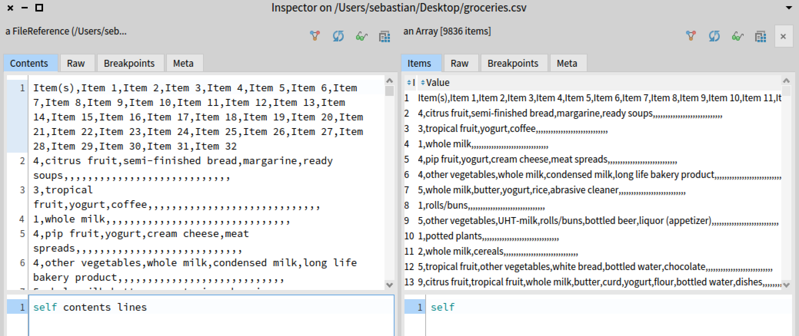

# Market Basket Analysis using A-Priori Algorithm

In this tutorial we will show an application of the A-Priori algorithm. 
You can find it at [pharo-ai/a-priori](https://github.com/pharo-ai/APriori).
We will analyze a dataset that contains a list of transactions of supermarket items that were bought.

You need to install the A-Priori algorithm.
To do that, execute the following script in your Pharo image:

```st
Metacello new
  repository: 'github://pharo-ai/a-priori:v1.0.0';
  baseline: 'AIAPriori';
  load.
```

The A-Priori algorithm is going to give us some associations rule of the most frequently items that are bought together.
For example, if someone goes to the supermarket and buys eggs, butter vegetables and yogurt is likely that they will buy milk too.

## Importing the data

First, let's download the [dataset CSV file from Kaggle](https://www.kaggle.com/datasets/irfanasrullah/groceries).

Then, we need to import the csv file into memory with this line. You need to change the path to location of where you downloaded the file.

```st
file := 'your-path-to-the-file/groceries.csv' asFileReference.
```

If we inspect the contents of the file, we will see that we have some empty spaces. Also it has a header.



So, we will do a little pre-processing to clean this dataset. We will divide each line by commas and then we will reject the empty fields.

```st
transactions := file contents lines allButFirst collect: [ :line |
    (',' split: line) allButFirst reject: [ :item | item isEmpty ] ].
```

## Instantiating A-Priori Algorithm

We need to create an instance of `APrioriTransactionsArray`.
It is only an object in which we need to pass the array of `transactions`.

```st
transactionsSource := APrioriTransactionsArray from: transactions.
```

Then, we instantiate the A-Priori algorithm with the transactions object that we just created.

```st
apriori := APriori forTransactions: transactionsSource.
```

A-Priori will find the combinations of items (we call them itemsets) that frequently appear together.
To do that, first we need to define, what it means to be "frequent".
This can be expressed with a metric called _support_ -- a percentage of transactions in which the given itemset appears.
By setting a minimum support threshold of 1\%, we tell the A-Priori algorithm that it should only select the combinations of items that appear in at least 1% of transactions.

```st
apriori minSupport: 0.01.
```

For running the algorithm we need to send the message `findFrequentItemsets` to the a-priori object. 

```st
apriori findFrequentItemsets.
```

The `apriori` object will mine frequent itemsets from the dataset of transactions and store them in `apriori frequentItemsets` attribute.
Those will include itemsets that only contain one item (for example, 50% of customers buy water, which means that water is a frequently purchased item).
But in our case, we are only interested in co-occurences of items (pairs, triplets, etc.) so we remove all frequent itemsets of size 1:

```st
frequentItemsets := apriori frequentItemsets select: [ :each | each size > 1 ].
```

Now we can ask A-Priori to build the association rules with `buildAssociationRules`.
Those are the rules in form `{left itemset} -> {right itemset}` that represent the situation when client has already purchased the items on the left and now we want to recommend him or her the items on the right.

```st
apriori buildAssociationRules.
```

We built *all* the associations of the transactions. That means that we built all the combinations of the items that were bought together. Now we need to filter them.
Because we only want to get the rules which have high _confidence_.
Confidence is another metric which tells us the conditional probability of a cient purchasing the items on the right given that this same client has already purchased items on the left.
We ask A-Priori to calculate confidence:

```st
apriori calculateAssociationRuleMetrics: {
    APrioriConfidenceMetric }.
```

Now we can filter the association rules that have at least 50\% confidence:

```st
rules := apriori associationRules select: [ :each | each confidence >= 0.5 ].
```

## Summary of the code

```st
file := 'your-path-to-the-file/groceries.csv' asFileReference.

transactions := file contents lines allButFirst collect: [ :line |
    (',' split: line) allButFirst reject: [ :item | item isEmpty ] ].

transactionsSource := APrioriTransactionsArray from: transactions.

apriori := APriori forTransactions: transactionsSource.

apriori minSupport: 0.01.

apriori findFrequentItemsets.

frequentItemsets := apriori frequentItemsets select: [ :each | each size > 1 ].

apriori buildAssociationRules.

apriori calculateAssociationRuleMetrics: {
    APrioriConfidenceMetric .
    APrioriLiftMetric }.

rules := apriori associationRules select: [ :each | each confidence >= 0.5 ].
```
